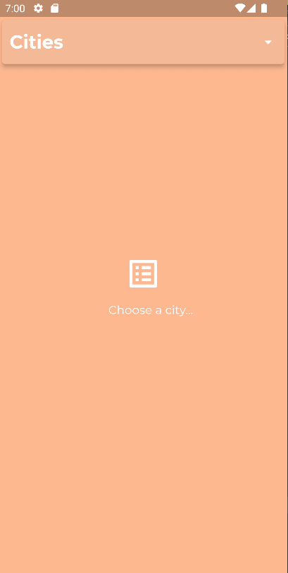

# TheWeatherBand

## About the project

The Weather Band is an application to track the weather fashionably for a rock'n'roll band staff. 
Its layout was based on the dribble project [Weather app](https://dribbble.com/shots/3011558-Weather-App).

### Structure

The project structure is based on:

* MVVM
* Clean Architecture

### Packages

> The main packages used

**flutter_modular**: Deal with navigation and data injection. 
**dio**: To HTTP requests. 
**connectivity_plus**: Check internet connectivity. 
**flutter_svg**: To handle SVG images. 
**shared_preferences**: To store local informations. 
**intl**: To convert dates.

## How to run

> It was developed only for Android platform.
>
> It runs on Android 23+.

1. Open the project on your favorite IDE (Android Studio, VSCode, etc).
2. Open the Terminal and navigates to the project root folder and run "flutter pub get".
3. Configure and run an Android Emulator Device (With android 23+).
4. Run the project selecting you emulator.

 # Preview

